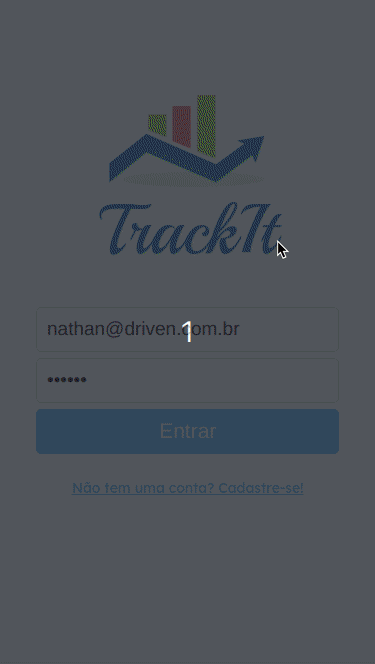

<p align="center" width="300px">

</p>
<p align="center">
  
  <a href="https://github.com/nathan4andrade/trackit/commits/main">
    
  </a>
   </p>

<p align="center">
 <a href="#-sobre-o-projeto">Projeto</a> •
 <a href="#-funcionalidades">Funcionalidades</a> •
 <a href="#-layout">Layout</a> • 
 <a href="#-tecnologias">Tecnologias</a> • 
  <a href="#-como-executar-o-projeto">Executar</a> • 
 <a href="#-autor">Autor</a> • 
</p>

## 💻 Projeto

TrackIt - é uma página desenvolvida para mobile em que o usuário pode acompanhar seu progresso em desenvolver um novo hábito!
Através das suas credenciais registradas o usuário terá uma experiência personalizada de acordo com as informações que insere. Contém as páginas: Login, Cadastro, Hábitos, Hoje e Histórico.

---

## ⚙️ Funcionalidades

- Como TrackIt você pode acompanhar seus hábitos:
  - [x] na página inicial você poderá iniciar uma sessão ou cadastrar-se;
  - [x] assim que a sessão é iniciada com um novo usuário a tela de Hoje é exibida, nessa página iram constar todos os hábitos cadastrados que seram feitos nesse dia;
  - [x] é possível nessa tela acessar também o Histórico e Hábitos;
  - [ ] na tela de Histórico constam todos os dias do mês, que seram pintados de acordo com seu progresso:
    - vermelho: algum hábito não foi realizado;
    - verde: todos os hábitos neste dia forma realizados;
    - amarelo: dia de hoje.
  - [ ] os dias que possuem coloração, exceto o dia de hoje podem ser clicados e mostram os hábitos que estavam programados para aquele dia.
- Além de acompanhar os hábitos que você já possui, com o TrackIt você continuará se desenvolvendo.

---

## 🎨 Layout

O layout somente para Mobile da aplicação está disponível no Figma:

<a href="https://www.figma.com/file/CJ4YvqRP6L4LkjwSiYbYMj/TrackIt?type=design&node-id=0%3A1&mode=design&t=vzmbenfvLAoCUD3f-1">

</a>

### Mobile



---

## 🚀 Como executar o projeto

Você pode somente acessar a [página](https://trackit-nathan4andrade.vercel.app/) ou instalar na sua máquina como seguem as instruções a seguir:

### Pré-requisitos

Antes de começar, você vai precisar ter instalado em sua máquina as seguintes ferramentas:
[Git](https://git-scm.com), [Node.js](https://nodejs.org/en/).
Além disto é bom ter um editor para trabalhar com o código como [VSCode](https://code.visualstudio.com/)

#### 🧭 Rodando a aplicação web (Front-end)

```bash
# Clone este repositório
$ git clone git@github.com:Nathan4Andrade/trackit.git
# Vá para a pasta da aplicação e instale as dependências
$ npm install
# Execute a aplicação em modo de desenvolvimento
$ npm run dev
# A aplicação será aberta na porta:3000 - acesse http://localhost:3000
```

---

## 🛠 Tecnologias

As seguintes ferramentas foram usadas na construção do projeto:

<p align="center">
<a src="https://reactjs.org/">
 </a> ✦ <a src="https://github.com/ReactTraining/react-router/tree/master/packages/react-router-dom"></a> ✦ <a src="https://styled-components.com/"></a>
✦ <a src="https://axios-http.com/"></a> ✦ <a src="https://https://day.js.org/"></a> ✦ <a src="https://github.com/wojtekmaj/react-calendar"></a> ✦ <a src="https://mhnpd.github.io/react-loader-spinner/"></a> ✦ <a src="https://github.com/kevinsqi/react-circular-progressbar"></a>
</p>

> Veja o arquivo [package.json](./package.json)

---

## 🦊 Autoria

<a href="https://www.linkedin.com/in/nathanandradehenriques/" >
 
 <p>Nathan Andrade</p>
</a>
  
---
